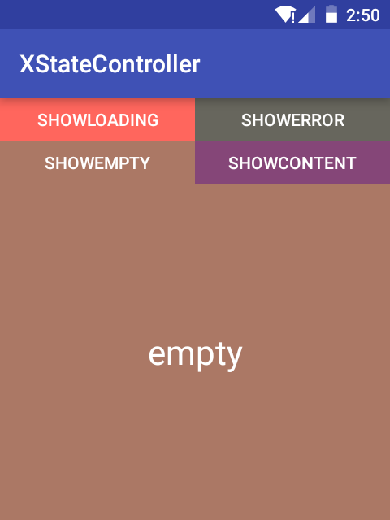

#XStateController
`StateController`顾名思义：状态控制机，用作几个状态的切换。该控件可以在`Loading` & `Empty` & `Error`& `Content`四个状态的自定义动画切换。

[](https://jitpack.io/#limedroid/XStateController)

## 特性

* 不受布局层级的控制，可任意大小、任意层级
* 支持xml设置状态布局资源
* 支持java代码设置状态布局
* 可自定义动画切换状态
* 可注册状态切换回调
* 支持异常情况的状态保存
* 可以设置一个或几个状态，无需全部状态设置

## 集成步骤

### step1 

在根项目的`build.gradle`文件中添加

```groovy
allprojects {
		repositories {
			...
			maven { url 'https://jitpack.io' }
	}
}
```

### step2

添加依赖

```groovy
dependencies {
	   compile 'compile 'com.github.limedroid:XStateController:v1.1.0'
}
```



## 使用

```java
 <cn.droidlover.xstatecontroller.XStateController
        android:id="@+id/controller"
        android:layout_width="match_parent"
        android:layout_height="match_parent"
        app:x_emptyLayoutId="@layout/view_empty">
       

        <TextView
            android:layout_width="match_parent"
            android:layout_height="match_parent"
            android:background="#854678"
            android:gravity="center"
            android:text="Content"
            android:textColor="@android:color/white"
            android:textSize="28sp" />

    </cn.droidlover.xstatecontroller.XStateController>
```

### 说明

* 当`XStateController`仅有一个子view（ViewGroup）时，该子view则为`ContentView`
* 可以通过xml属性设置布局，也可代码设置

### attrs设置状态布局资源

```xml
 <attr name="x_contentLayoutId" format="reference" />
 <attr name="x_loadingLayoutId" format="reference" />
 <attr name="x_emptyLayoutId" format="reference" />
 <attr name="x_errorLayoutId" format="reference" />
```

* `x_contentLayoutId`设置内容布局资源
* `x_loadingLayoutId`设置加载中状态的布局资源
* `x_emptyLayoutId`设置空状态的布局资源
* `x_errorLayoutId`设置错误状态的布局资源

### 常见api

设置各状态的布局资源

```java
loadingView(loadingView)；  //设置加载中的view
emptyView(emptyView)； 	//设置空view
errorView(errorView)；	//设置errorView
contentView(contentView); //设置contentView
```

状态切换

```java
showLoading();		//切换到loading状态
showError();		//切换到error状态
showEmpty();		//切换到empty状态
showContent();		//切换到content状态
```

注册状态切换回调

```java
registerStateChangeListener(xx);
```

回调的定义

```java
public interface OnStateChangeListener {
		//状态切换时回调，oldState当前状态,newState目标状态
        void onStateChange(int oldState, int newState);
		//动画，可自定义切换动画
        void animationState(View exitView, View enterView);
    }
```

使用时可直接继承*SimpleStateChangeListener*


